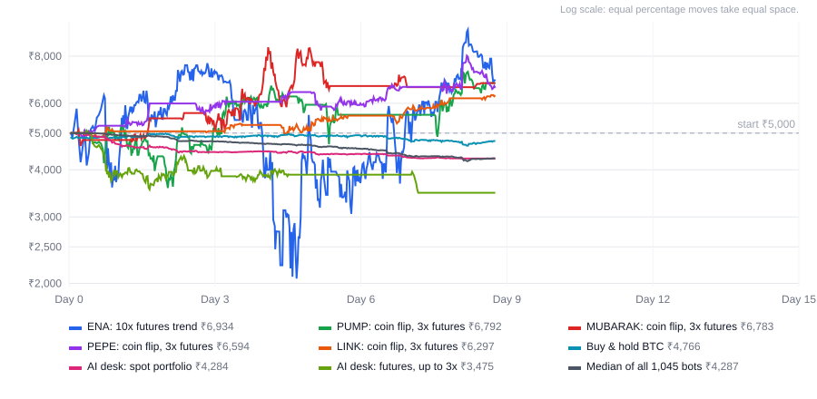

# CoinDCX paper-trading bots

1,043 original rule-based trading bots each get ₹5,000 of **simulated** money and trade for 15 days on live CoinDCX INR prices, across 47 coins. The current goal is ₹15,000: ₹10,000 profit on a ₹5,000 wallet. Every rule runs independently alongside coin-flip controls; those virtual wallets cannot be added together as spendable capital. None of the original strategies made money on average after fees and estimated tax in the [six-month backtests](#what-the-backtests-found). The 282 low-cost twins and two AI-desk books are experiments too. Four later-start, single-wallet spot portfolios now run slow trend, relative momentum and breakout rules as a separate paper cohort; none passed its [17-window historical screen](docs/strategy-lab.md). GitHub Actions runs the paper simulation on a schedule. No real money, exchange account or exchange API key is connected.

The user has since specified a **one-day** deadline for the ₹10,000 profit. The running 15-day challenge does not test that deadline. A separate [255-day historical one-day screen](docs/one-day-feasibility.md) found no fixed rule or hindsight-picked single-coin spot hold that turned ₹5,000 into ₹15,000 after modeled costs. The one-day request does not change this paper run's original start and end dates.

<!-- DASHBOARD:START -->
### Live results: day 6 of 15

Last updated 06 Oct 2026, 08:12 IST. Runs from 30 Sep 2026, 18:45 IST to 15 Oct 2026, 18:45 IST. Refreshed about every 30 minutes; each run catches up on everything it missed.

Each original leaderboard bot started with ₹5,000 of simulated money. The goal is ₹15,000 (3x). BTC/INR since the start: -0.4% (₹85,22,786 to ₹84,87,644).

1,045 bots on 47 coins. 105 are up and 848 are down; 1 are wiped out. The median bot is at ₹4,572. 340 of 987 bots are ahead of simply holding their coin.

**Spot fill check.** Of 18,428 simulated spot orders checked against the same 15-minute candle's reported volume, 742 were on zero-volume candles, 3,989 were larger than the candle's entire traded value, 5,878 used more than 10% of it, and 0 could not be matched to a recent candle. These are execution warnings, not proof that any other order could have filled at the quoted price. Futures results use INR spot candles as a price proxy, not CoinDCX futures fills. [Live-readiness criteria](docs/live-readiness.md).

**AI trading desk.** A team of AI agents (Google Gemini, free tier) meets every 2 hours to run two books: three analysts (market, news, quant), a bull and a bear who debate, a trader, a three-person risk team, and a portfolio manager who makes the final call. The desk's limits are enforced in code, not left to the AI.

| Book | Value if sold now | Return | Rank | Closed trades | Now |
|---|---|---|---|---|---|
| AI desk: spot portfolio | ₹4,402 | -12.0% | 612 of 1,045 | 11 | holding BTC, SOL |
| AI desk: futures, up to 3x | ₹3,879 | -22.4% | 790 of 1,045 | 8 | flat |

Both books started with ₹5,000 on 30 Sep 2026, 19:00 IST. **Latest decision, 06 Oct 2026, 07:42 IST** (market neutral, news mood greed, Fear & Greed 73): We accept the trader's recommendation to maintain our existing core spot positions in BTC and SOL while keeping the futures book flat. In a neutral market regime with negative short-term momentum across major assets, opening new futures positions risks unnecessary whipsaws and funding drag. We slightly tighten the stop-loss levels on BTC and SOL to protect against further downside volatility while maintaining significant cash reserves to preserve optionality. This cautious posture respects our recent trading lessons regarding tax drag and churn during choppy consolidation. Spot: BTC 29% (stop -2%, target +20%), SOL 25% (stop -2.5%, target +20%). Futures: flat.

Minutes of every meeting: https://github.com/ttannu/coindcx-paper-bots/blob/main/docs/desk.md

**Top 15 bots**

| # | Bot | Value if sold now, after costs and tax | Return | Progress to ₹15,000 | Closed trades | Worst drop | Now |
|---|---|---|---|---|---|---|---|
| 1 | NEAR: 10x futures trend | ₹11,030 | +120.6% | 73.5% | 2 | 53.3% | long 10x |
| 2 | MUBARAK: coin flip, 3x futures | ₹6,664 | +33.3% | 44.4% | 5 | 31.3% | flat |
| 3 | NEAR: 3x futures trend | ₹6,648 | +33.0% | 44.3% | 2 | 19.6% | long 3x |
| 4 | PEPE: coin flip, 3x futures | ₹6,074 | +21.5% | 40.5% | 5 | 12.3% | short 3x |
| 5 | ONE: coin flip, 3x futures | ₹5,805 | +16.1% | 38.7% | 6 | 33.2% | flat |
| 6 | MUBARAK: buy & hold | ₹5,596 | +11.9% | 37.3% | 0 | 12.7% | holding MUBARAK |
| 7 | PUMP: coin flip, 3x futures | ₹5,591 | +11.8% | 37.3% | 7 | 32.7% | flat |
| 8 | PENGU: coin flip, 3x futures | ₹5,542 | +10.8% | 36.9% | 9 | 22.7% | flat |
| 9 | SAGA: long/short 12/48h | ₹5,508 | +10.2% | 36.7% | 1 | 6.6% | long 1x |
| 10 | ENA: coin flip, 3x futures | ₹5,484 | +9.7% | 36.6% | 5 | 8.8% | flat |
| 11 | LINK: coin flip, 3x futures | ₹5,456 | +9.1% | 36.4% | 3 | 7.0% | short 3x |
| 12 | BONK: coin flip, 3x futures | ₹5,411 | +8.2% | 36.1% | 4 | 22.7% | short 3x |
| 13 | MUBARAK: coin flip #1 | ₹5,374 | +7.5% | 35.8% | 7 | 7.7% | cash |
| 14 | ICP: coin flip, 3x futures | ₹5,316 | +6.3% | 35.4% | 5 | 22.1% | short 3x |
| 15 | APT: coin flip, 3x futures | ₹5,297 | +5.9% | 35.3% | 4 | 15.4% | long 3x |

**The original bots**

| Bot | Value if sold now | Return | Rank | Closed trades | Now |
|---|---|---|---|---|---|
| Grid trader | ₹4,999 | -0.0% | 200 of 1,045 | 1 | cash |
| Self-learning ensemble | ₹4,982 | -0.4% | 228 of 1,045 | 2 | cash, nothing has an edge |
| Dip buyer (RSI) | ₹4,980 | -0.4% | 230 of 1,045 | 1 | cash |
| Buy & hold BTC | ₹4,912 | -1.8% | 285 of 1,045 | 0 | holding BTC |
| Breakout hunter | ₹4,755 | -4.9% | 416 of 1,045 | 8 | holding BTC, ETH |
| Trend follower | ₹4,048 | -19.0% | 754 of 1,045 | 28 | cash |
| Goal chaser (10x futures) | ₹2,581 | -48.4% | 916 of 1,045 | 9 | short 10x |

**Added on 1 Oct, after the [backtests](docs/research.md)**

| Bot | Value if sold now | Return | Rank | Closed trades | Now |
|---|---|---|---|---|---|
| Liquid 5, held | ₹4,815 | -3.7% | 363 of 1,045 | 0 | holding BTC, DOGE, ETH, SOL, XRP |
| Liquid 5, BTC trend filter | ₹4,815 | -3.7% | 364 of 1,045 | 0 | holding BTC, DOGE, ETH, SOL, XRP |

**Slow spot paper experiments.** These four separate virtual wallets each start with ₹5,000 when their code first runs. They are excluded from the original leaderboard because they started later. None made money on average in 17 earlier 15-day windows after costs, and none met the ₹15,000 target. They collect forward data only; [rules, backtests and fill limits](docs/strategy-lab.md).

| Paper rule | Started | Value if sold now | Return | Closed trades | Now |
|---|---|---:|---:|---:|---|
| BTC 30-day trend timing | 03 Oct, 15:30 IST | ₹4,931 | -1.4% | 0 | holding BTC |
| four-coin 7-day relative momentum | 03 Oct, 15:30 IST | ₹4,967 | -0.7% | 0 | holding BTC |
| four-coin 20/10-day breakout | 03 Oct, 15:30 IST | ₹5,000 | +0.0% | 0 | cash |
| four-coin 30-day time-series momentum | 03 Oct, 15:30 IST | ₹4,917 | -1.7% | 0 | holding BTC, ETH, SOL, XRP |

**Strategy report card.** Each strategy runs separately on every coin. "Beat holding" counts the coins where it is ahead of buying that coin and holding it.

| Strategy | Median return | Best coin | Worst coin | In profit | Beat holding | Wiped out | Paper screen? |
|---|---|---|---|---|---|---|---|
| RSI dip <30 ±6% | +0.0% | ZEC +3.3% | NEAR -7.0% | 19/47 | 39/47 | 0 | not yet |
| RSI dip <30 ±3% | +0.0% | QNT +3.0% | NEAR -8.4% | 19/47 | 38/47 | 0 | not yet |
| RSI dip <25 ±3% | +0.0% | FIL +1.0% | NEAR -4.5% | 17/47 | 39/47 | 0 | not yet |
| Pump rider | +0.0% | SAGA +0.0% | ONE -19.5% | 0/47 | 34/47 | 0 | not yet |
| Grid 3% | -0.2% | SIREN +3.0% | ONE -7.0% | 11/47 | 39/47 | 0 | not yet |
| Self-learning | -2.5% | ZEC +4.5% | ICP -11.0% | 10/47 | 29/47 | 0 | not yet |
| Breakout 48/24h | -4.3% | SIREN +0.0% | MUBARAK -14.5% | 0/47 | 26/47 | 0 | not yet |
| Grid 1.5% | -4.5% | SIREN +3.8% | ONE -22.1% | 1/47 | 29/47 | 0 | not yet |
| Buy & hold | -4.6% | MUBARAK +11.9% | SAGA -14.8% | 7/47 | – | 0 | benchmark |
| Coin flip, 3x futures | -5.9% | MUBARAK +33.3% | FIL -32.1% | 14/47 | 19/47 | 0 | luck control |
| Breakout 20/10h | -7.3% | SAGA +0.1% | RENDER -22.7% | 1/47 | 9/47 | 0 | not yet |
| Coin flip #1 | -11.1% | MUBARAK +7.5% | SAGA -23.2% | 2/47 | 7/47 | 0 | luck control |
| Coin flip #2 | -11.2% | BCH -3.4% | QNT -24.3% | 0/47 | 3/47 | 0 | luck control |
| Coin flip #3 | -12.2% | AAVE -0.6% | PENGU -24.9% | 0/47 | 4/47 | 0 | luck control |
| Trend 24/96h | -14.1% | MUBARAK +4.0% | PHA -39.7% | 1/47 | 9/47 | 0 | not yet |
| Long/short 12/48h | -15.4% | SAGA +10.2% | ONE -32.9% | 1/47 | 8/47 | 0 | not yet |
| Trend 12/48h | -18.5% | SAGA -5.0% | PHA -37.9% | 0/47 | 5/47 | 0 | not yet |
| Trend 6/24h | -24.9% | BONK -9.6% | KAS -45.8% | 0/47 | 0/47 | 0 | not yet |
| 3x futures trend | -38.1% | NEAR +33.0% | RENDER -70.6% | 1/47 | 2/47 | 0 | not yet |
| Fast trend 5/20h | -46.6% | NEAR -24.9% | SIREN -69.3% | 0/47 | 0/47 | 0 | not yet |
| Fast trend 2/8h | -59.7% | ADA -46.6% | SIREN -84.5% | 0/47 | 0/47 | 0 | not yet |
| 10x futures trend | -84.1% | NEAR +120.6% | RENDER -101.5% | 1/47 | 1/47 | 1 | not yet |

**How much of this is luck?** The 188 coin-flip bots trade at random. The luckiest is MUBARAK: coin flip, 3x futures at +33.3%, and their median is -11.1%. With this many bots, some will look brilliant by chance alone. The early paper screen starts after 3 days and asks whether the median bot is profitable after costs, beats the coin flips, and beats holding on most coins. Passing it does not establish a live trading edge.

**Where the money went.** On average a bot's trades have made -6.6% of its starting money from price moves, before any costs. The spread took 3.7%, fees and GST 5.1%, tax 1.1% and futures funding 0.1%, which leaves -16.6%. 8 of the 22 strategies are ahead before costs, and 1 after them. Tax is charged on every profitable sale and losses can't be set off against it, so a strategy can pay tax while losing money. Average per bot, as a share of its starting money, counting the costs of selling what is still held:

| Strategy | Bots | Price moves | Spread | Fees and GST | Tax | Funding | Result |
|---|---|---|---|---|---|---|---|
| RSI dip <25 ±3% | 47 | +1.2% | -0.3% | -0.5% | -0.3% | – | +0.0% |
| RSI dip <30 ±6% | 47 | +3.7% | -1.3% | -1.8% | -0.9% | – | -0.3% |
| RSI dip <30 ±3% | 47 | +3.3% | -1.3% | -1.8% | -0.8% | – | -0.6% |
| Grid 3% | 47 | +3.3% | -1.4% | -1.8% | -0.8% | – | -0.7% |
| Self-learning | 47 | -1.7% | -0.3% | -0.3% | -0.6% | -0.1% | -3.0% |
| Pump rider | 47 | -1.7% | -0.6% | -0.7% | -0.0% | – | -3.1% |
| Added on 1 Oct | 2 | -2.1% | -0.5% | -1.2% | -0.0% | – | -3.7% |
| Breakout 48/24h | 47 | -2.4% | -0.9% | -1.3% | -0.1% | – | -4.6% |
| Buy & hold | 47 | -2.3% | -0.8% | -1.2% | -0.4% | – | -4.6% |
| Grid 1.5% | 47 | +8.5% | -5.0% | -6.8% | -1.9% | – | -5.2% |
| Coin flip, 3x futures | 47 | +4.1% | -1.8% | -2.1% | -6.0% | -0.2% | -6.0% |
| Breakout 20/10h | 47 | -3.5% | -1.9% | -2.5% | -0.2% | – | -8.1% |
| Coin flip #1 | 47 | +0.8% | -4.2% | -6.1% | -1.1% | – | -10.6% |
| Original bots | 7 | -4.9% | -2.0% | -3.4% | -0.2% | -0.2% | -10.7% |
| Coin flip #3 | 47 | -0.9% | -4.2% | -6.0% | -0.9% | – | -11.9% |
| Coin flip #2 | 47 | +0.0% | -4.5% | -6.5% | -1.0% | – | -12.1% |
| Trend 24/96h | 47 | -5.5% | -3.3% | -4.9% | -0.4% | – | -14.0% |
| Long/short 12/48h | 47 | -12.6% | -0.6% | -0.8% | -0.7% | -0.2% | -14.8% |
| AI desk | 2 | -12.5% | -1.5% | -2.2% | -0.9% | -0.1% | -17.2% |
| Trend 12/48h | 47 | -6.8% | -4.5% | -6.5% | -0.3% | – | -18.0% |
| Trend 6/24h | 47 | -8.4% | -6.7% | -9.6% | -0.4% | – | -25.1% |
| 3x futures trend | 47 | -30.4% | -2.4% | -2.9% | -2.4% | -0.4% | -38.4% |
| Fast trend 5/20h | 47 | -14.5% | -13.0% | -18.9% | -0.4% | – | -46.8% |
| Fast trend 2/8h | 47 | -18.1% | -16.9% | -25.0% | -0.4% | – | -60.5% |
| 10x futures trend | 47 | -60.7% | -4.9% | -5.8% | -4.9% | -0.8% | -77.1% |
| **All bots** | 1,045 | -6.6% | -3.7% | -5.1% | -1.1% | -0.1% | -16.6% |

**Low-cost test.** Since 1 Oct the strategies that had an edge before costs in the backtests also run with CoinDCX's VIP 1 fee (0.17% instead of 0.5%, plus GST). The grids and dip-buyers place limit orders, which pay no spread but fill at exactly their price and only once the price trades through it; stops and the other exits are market orders and still pay it. Tax is unchanged, so the gap to the same strategy at normal costs is what fees and spread took. These 282 bots are judged against a buy & hold and a coin flip at the same low cost, and are left out of the rankings above.

| Strategy | Median, normal costs | Median, low cost | Fees and spread | In profit | Beat holding | Paper screen? |
|---|---|---|---|---|---|---|
| Grid 3% | -0.2% | +0.9% | -3.2% → -0.8% | 36/47 | 40/47 | yes |
| Grid 1.5% | -4.5% | +0.8% | -11.7% → -2.6% | 31/47 | 40/47 | yes |
| RSI dip <30 ±3% | +0.0% | +0.6% | -3.1% → -0.7% | 28/47 | 39/47 | yes |
| RSI dip <30 ±6% | +0.0% | +0.4% | -3.1% → -0.9% | 27/47 | 40/47 | yes |
| Buy & hold | -4.6% | -3.8% | -2.0% → -1.2% | 8/47 | – | benchmark |
| Coin flip #1 | -11.1% | -7.5% | -10.3% → -6.4% | 5/47 | 19/47 | luck control |

VIP 1 needs ₹5,00,000 of trading in 30 days. The busiest of these strategies, grid 1.5%, has traded ₹56,455 per bot in 5.6 days, a pace of ₹3,05,047 a month, so a ₹5,000 account trading this way would not get there on its own.

Costs so far across all bots: ₹2,60,885 in fees and GST, ₹43,842 of TDS held back (refundable when you file taxes), and ₹49,177 of estimated tax.

**What the original self-learning bot sees.** Its best strategy variants over the last 3 days, after all costs:

| Variant | Last 3 days | Signal now |
|---|---|---|
| BTC 72h breakout | +0.2% | long |
| BTC hold long | +0.2% | long |
| BTC trend 24/96h, long only | +0.1% | long |
| BTC trend 24/96h | +0.1% | long |
| ETH RSI reversion | +0.1% | flat |
<!-- DASHBOARD:END -->

## The bots

**The swarm.** Each of the 47 coins gets the same 22 bots, 1,034 in all:

| Strategy | Trades | Rules |
|---|---|---|
| Buy & hold | spot | Buys the coin once with all its money and never sells. Every other strategy on the coin is measured against this. |
| Trend 6/24h | spot | 1-hour candles. Buys when the 6-hour average is above the 24-hour average and price crosses or bounces above the faster one. Sells on a trailing stop 2.5x ATR below the high, or a close below the slower average. |
| Trend 12/48h | spot | The same with 12- and 48-hour averages. |
| Trend 24/96h | spot | The same with 24- and 96-hour averages. |
| Fast trend 2/8h | spot | The same on 15-minute candles, with 8- and 32-candle averages (2 and 8 hours). |
| Fast trend 5/20h | spot | The same on 15-minute candles, with 20- and 80-candle averages (5 and 20 hours). |
| RSI dip <25 ±3% | spot | 15-minute candles. Buys when RSI(14) falls below 25. Sells at +3%, -3%, when RSI recovers above 55, or after 12 hours. |
| RSI dip <30 ±3% | spot | The same, buying below RSI 30. |
| RSI dip <30 ±6% | spot | The same, buying below RSI 30 and selling at +6% or -6%. |
| Breakout 20/10h | spot | 1-hour candles. Buys a close above the 20-hour high. Sells a close below the 10-hour low, or at a stop 2x ATR below entry. |
| Breakout 48/24h | spot | The same with the 48-hour high and the 24-hour low. |
| Grid 1.5% | spot | 15-minute candles. Splits the money into 6 lots, buys a lot each time price falls another 1.5%, and sells each lot 1.5% above where it bought. Re-centres when price runs up. |
| Grid 3% | spot | The same with 3% steps. |
| Pump rider | spot | 1-hour candles. Buys when the coin is up 8% or more in 24 hours, the last candle closed green, and price is above its 20-hour average. Sells on a trailing stop 3x ATR below the high, a close below the 20-hour average, or after 24 hours. |
| Coin flip #1, #2, #3 | spot | Luck controls. After every hourly candle a fixed pseudo-random draw decides: in cash, the bot buys with 1-in-12 odds; holding, it sells with 1-in-12 odds. They pay the same costs as the others. |
| 3x futures trend | futures | Always all-in on futures at 3x: long when the 9-hour average is above the 21-hour average, short otherwise. A 33% move the wrong way wipes out the position. |
| 10x futures trend | futures | The same at 10x. A 9.5% move the wrong way wipes out the position. |
| Long/short 12/48h | futures | Futures at 1x: long when the 12-hour average is above the 48-hour average, short otherwise. A near-total adverse move can still liquidate the position. |
| Coin flip, 3x futures | futures | Luck control on futures at 3x. After every hourly candle, with 1-in-12 odds, it opens a random long or short when flat, or closes its position. |
| Self-learning | futures | The self-learning bot below, on this coin alone: 11 shadow variants (trend long/short and long-only, breakouts, RSI reversion, hold long, hold short), following the best one after costs, at 1x or less, with the same loss brake and capital floor. |

The strategy report card on the dashboard ranks the 22 strategies by their median return across all 47 coins. Its early paper screen starts after 3 days and asks whether the median bot is in profit after costs, beats the coin-flip bots' median, and is ahead of simply holding the coin on more than half of the coins. Passing this screen is not evidence of a reliable live edge. The separate [live-pilot evidence screen](docs/live-readiness.md) also checks historical windows, forward paper results, and fill warnings. With over a thousand bots, the best few usually owe much of their lead to luck, which is why the coin-flip bots are there.

**The coins.** Picked on 30 Sep 2026 from CoinDCX's 339 active INR markets: at least ₹5 lakh traded in the previous 24 hours, a bid-ask spread of 1.5% or less, and a price that moved in at least 148 of the previous 168 hours. Stablecoins and tokenised gold were left out. From most to least volatile: SAGA, QNT, SIREN, ONE, PHA, MUBARAK, PUMP, ENA, ONDO, NEAR, HBAR, PENGU, SEI, INJ, FIL, VVV, APT, ICP, BONK, GALA, KAS, SUI, ARB, RENDER, AAVE, XLM, UNI, POL, ZEC, LINK, VET, TAO, AVAX, BCH, DOT, PEPE, TRUMP, ADA, DOGE, XRP, SHIB, SOL, HYPE, TRX, BNB, ETH, BTC. Each also has an INR-margined futures contract on CoinDCX.

**The original bots.** The first 7 bots keep running unchanged:

| Bot | Rules |
|---|---|
| Self-learning ensemble | Runs 22 strategy variants on BTC and ETH (trend, breakout, mean reversion, hold long, hold short) as unfunded shadow accounts that pay the same costs, and scores each on its last 3 days after fees and tax. Every hour it follows the best one. It switches only when another is ahead by more than 2 points and at least 12 hours have passed since its last change, and it holds cash when none has made at least 2%. Trades futures at 1x or less (lower liquidation risk than leveraged futures, about a tenth of spot fees) and takes smaller positions when the market is swinging hard. Studies the previous 7 days before its first trade. Checked every 15 minutes: if it falls 8% below its best value it holds cash for 24 hours, and if it falls 15% below its starting money it stops trading for good. |
| Buy & hold BTC | Benchmark. Buys Bitcoin once with all ₹5,000 and never sells. |
| Trend follower | 1-hour candles on BTC, ETH, SOL. Buys when the 20-hour average is above the 50-hour average and price bounces back above the 20-hour average. Sells on a trailing stop (2.5x ATR) or when price closes below the 50-hour average. |
| Dip buyer (RSI) | 15-minute candles on BTC and ETH. Buys when RSI(14) falls below 30. Sells at +3% profit, -3% loss, when RSI recovers above 55, or after 12 hours. |
| Breakout hunter | 1-hour candles on BTC, ETH, SOL, XRP, DOGE. Buys when price closes above its 20-hour high. Sells when price closes below its 10-hour low or hits a stop 2x ATR below entry. |
| Grid trader | 15-minute candles on BTC. Splits the money into 6 lots, buys a lot each time price falls another 2%, and sells each lot 2% above where it bought. Re-centres when price runs up. |
| Goal chaser (10x futures) | What chasing 20x in 15 days looks like. Always all-in on BTC futures at 10x leverage: long when the 9-hour average is above the 21-hour average, short otherwise. A 9.5% move the wrong way wipes out the position. |

**Added on 1 Oct, after the backtests.** Two bots built from what [the backtests](docs/research.md) found, replayed from the same start as the others:

| Bot | Rules |
|---|---|
| Liquid 5, held | Holds the 5 coins with the most CoinDCX INR volume (the median day of the last 30) in equal parts, passing over any whose smallest order is more than its share (ZEC's is about ₹1,400) for the next one. Every 3 days it sells a coin that has dropped out of the 10 most traded and fills the gap. The yardstick for the next bot. |
| Liquid 5, BTC trend filter | The same 5 coins, held only while BTC's price is above its 30-day average, and in cash otherwise. It checks every 3 days. In 17 past 15-day windows it ended flat (+0.1% a window after costs) while holding the same coins lost 2.2%, and its worst window was -10% instead of -20%. It was the best of 14 timing rules tried, which flatters that result; these 15 days are its real test. |

**Low-cost twins, added on 1 Oct.** On each of the 47 coins, 6 strategies also run a second time with the lowest costs a CoinDCX INR account can realistically reach: buy & hold, the 1.5% and 3% grids, the two RSI dip <30 strategies, and coin flip #1. They pay the VIP 1 spot fee, 0.17% instead of 0.5% plus GST, and the grids and dip-buyers place limit orders instead of trading at the market. A limit order pays no spread, but it fills at exactly its price and only once a later candle trades through it. The dip-buyers bid the signal candle's close for an hour, so they only get in if the price keeps falling. Stops and time exits stay market orders. Tax is unchanged, so the gap between a twin and its original is what fees and spread took. The 282 twins are compared with buy & hold and a coin flip at the same low cost in their own table on the dashboard, and are left out of the rankings, the report card, and what the AI desk sees.

**Slow paper portfolios, added on 3 Oct.** Four independent ₹5,000 virtual spot wallets on BTC, ETH, SOL and XRP test BTC 30-day trend timing, four-coin 30-day time-series momentum, four-coin 7-day relative momentum, and a four-coin 20/10-day breakout. They use completed hourly candles and wait one more hour before a paper fill, reserve estimated tax, and defer orders on quiet hours. They start when the new code first runs, so their results are kept out of the older bots' rankings. In 17 earlier 15-day tests none had a positive average return after costs, so this is a forward research cohort, not a recommendation to trade them with real money. [Rules and results](docs/strategy-lab.md).

No bot ever changes its rules. The self-learning bots only choose between fixed variants, and the fixed bots are the control group that shows whether those choices actually help.

## The AI trading desk

A team of AI agents runs two more paper books with ₹5,000 each: a **spot portfolio** of up to 5 coins, and a **futures book** with one position at a time, long or short, at up to 3x. The structure follows [TradingAgents](https://github.com/TauricResearch/TradingAgents) (Apache-2.0), an open-source framework that models a trading firm; this is a small rewrite of the idea, not its code.

Every 2 hours the desk meets:

1. Three analysts report at the same time. The **market analyst** reads the price action of all 47 coins over the last hour to the last week: momentum, RSI, trend, volatility, distance from the 7-day high, spread, and volume. The **news analyst** reads the last day's headlines from CoinDesk, Cointelegraph, Decrypt, Bitcoin Magazine, and CryptoSlate, the Fear & Greed index, and CoinGecko's trending coins. The **quant analyst** reads what the rule-based bots have found on each coin, compared with holding it and with the coin-flip bots, and how futures traders are positioned on Hyperliquid (funding rates and open interest).
2. A **bull** and a **bear** researcher debate the reports.
3. The **trader** turns the research and the debate into a plan for both books.
4. A **risk team** of three (aggressive, neutral, conservative) reviews the plan.
5. The **portfolio manager** makes the final decision, and notes a lesson from how the desk's trades have worked out, which later meetings see.

The code, not the AI, enforces the limits. At most 30% of the spot book goes into one coin and 95% in total, and positions under 5% are dropped. Only coins with fresh prices and a real market can be traded: at least ₹5 lakh of CoinDCX INR volume in the last 24 hours, with no trades in at most a quarter of those 15-minute candles, because a quiet book shows stale prices (added on 1 Oct, after the backtests below showed how much stale prices distort results). A coin it holds that stops qualifying is kept as it is, with its stop, until it can be traded again. Futures leverage is 1x to 3x. Every position gets a stop loss (2-15% away on spot, 1-10% on futures) that can be tightened but never loosened, and a book that falls below 70% of its starting money closes out and stops for good. Decisions fill at the next 15-minute close, so the desk never trades at a price it has already seen, and they pay the same fees and tax as every other bot. Changes smaller than 5% of a book are skipped to save fees.

The agents run on Google's free Gemini API tier. The analysts, researchers, and risk team use Gemini 3.5 Flash Lite, with 3.1 Flash Lite and Gemma 4 as fallbacks. The trader and the portfolio manager use the strongest Gemini Flash model that is available (3.8 down to 3.5), falling back to the lighter models. When a model is busy or out of quota, the desk moves on to the next one. If the meeting still can't finish, it is skipped: the books keep their positions and stops, and the desk tries again 30 minutes later. The minutes of every meeting, with what each agent said, are in [`docs/desk.md`](docs/desk.md). On the free tier Google may use the prompts to improve its products; they contain only public prices, headlines, and the bots' simulated results.

AI traders have no proven edge. In [Alpha Arena](https://nof1.ai) Season 1 (October 2025), six leading AI models each traded $10,000 of real money on crypto futures for about two weeks: two finished ahead, and four lost between 42% and 59%. The coin-flip bots and buy & hold are the yardstick for this desk too.

## What the simulation charges

The configured costs estimate a CoinDCX INR account in India; an actual account's fee tier and tax treatment must be checked. They are set in [`config.json`](config.json).

- **Spot trading fee:** 0.5% of each trade, plus 18% GST on the fee.
- **Futures fee (INR margin):** 0.05% plus GST, and 0.01% funding every 8 hours. Futures are priced off CoinDCX's INR spot candles.
- **Slippage:** spot buys fill above the candle price and sells below it by half of the coin's bid-ask spread, measured on 30 Sep 2026: from 0.1% (the minimum) for the most liquid coins up to 0.73% for the thinnest. Futures fill 0.05% away.
- **TDS assumption:** 1% of each spot sale is held back once that virtual wallet's sales pass ₹50,000, then counted as a credit toward its value. Actual Indian thresholds depend on the payer and tax year, not the count of paper bots; another tax jurisdiction could differ. The simulator does not model futures TDS.
- **Tax assumption:** an estimated 31.2% (30% plus 4% cess) of each profitable Indian spot sale, following the no-loss-setoff rule in the [Income-tax Act, 2025, section 194(1), table row 4](https://www.incometaxindia.gov.in/documents/d/guest/income_tax_act_2025_as_amended_by_fa_act_2026-pdf). Fees are not deducted from taxable gains in this model. Actual jurisdiction, surcharge and futures treatment require review. A bot that wins early and then loses everything can show a negative after-tax value because tax remains due on early wins.
- **Minimum order:** ₹100, and quantities are rounded down to each coin's lot size.
- **Low-cost twins:** the VIP 1 spot fee of 0.17% plus GST, which CoinDCX charges from ₹5 lakh of trading in 30 days, and no spread on limit orders. Everything else is the same.

"Value if sold now" is what a bot would keep if it sold everything at that moment and paid all of the above. The dashboard's "Where the money went" table splits each strategy's result into what the price moves made and what the spread, fees, tax, and funding took, counting the costs of selling whatever is still held. The AI desk sees the same split for its own books at every meeting.

## What the backtests found

On 1 Oct the strategies were replayed over the six months before the launch: 12 back-to-back 15-day windows from 3 Apr to 30 Sep 2026, on all 47 coins, through the same code. Each was run three times: with no costs (the strategy's skill alone), with fees and spread, and with tax as well. Mean result per bot per window:

| Strategy | No costs | Fees and spread | Tax as well |
|---|---:|---:|---:|
| Buy & hold | +6.0% | +3.9% | +0.8% |
| Grid, 3% steps | +7.9% | 0.0% | -2.7% |
| Grid, 1.5% steps | +21.1% | -5.5% | -10.3% |
| RSI dip-buying | +13.2% | -3.5% | -6.5% |
| Self-learning | -2.6% | -4.0% | -6.2% |
| Trend-following, 6/24h | -16.4% | -45.0% | -47.5% |
| Coin flip | +3.0% | -23.8% | -27.2% |
| Coin flip, 3x futures | +3.1% | -7.4% | -20.9% |
| Trend-following, 3x futures | -32.6% | -41.1% | -55.0% |

- No rule-based strategy made money on average after costs. Buying and holding, which pays the costs once, came closest, and its result is the market's direction rather than skill: it made money in 5 of the 12 windows, and without the rally in the last one (+32%) its average would be -2.0%.
- Trend-following lost even before costs. On CoinDCX's INR prices short moves tended to reverse, partly because the last traded price bounces between the bid and the ask.
- Dip-buying and grids had an edge before costs, but mostly on thinly traded coins, where prices go stale. On the 10 most liquid coins a 1.5% grid made +6.3% before costs, against +25.1% on the other 37, which is too little to pay for its 60-odd trades.
- Picking the best bots of one window to run in the next lost money: -7.1% a window for the top 10 and -5.4% for the top 50.
- Strategies added for the test also failed after costs: holding the recent top gainers (16 versions, on liquid coins only), going long or short the strongest or weakest coin on futures, wider grids, slower breakouts, and following futures funding rates.
- Holding the 5 most liquid coins only while BTC was above its 30-day average ended flat (+0.1% a window) instead of losing 2.2%, and halved the worst window, but made money in only 4 of 17 windows: it avoided losses rather than finding profits.
- Cheaper trading wasn't enough. With CoinDCX's VIP 1 fee (0.17%) and limit orders, the 1.5% grid averaged -1.5% a window instead of -10.3%, the 3% grid -0.3%, and the dip-buyers -1.8% to -2.9%, while holding at the same fee made +1.6%. Filling those limit orders at the candle price, as the normal-cost bots fill, had shown +2% to +6%: profits from fills a real order can't get.

A round trip on CoinDCX spot costs about 2%, and the tax takes 31.2% of every winning trade with no set-off for the losing ones, so a strategy has to trade rarely and win big. Nothing tested here did that reliably. The method, the full results, and the three research mistakes that were caught along the way are in [`docs/research.md`](docs/research.md).

## How it runs

- GitHub is asked to run the [`simulate`](.github/workflows/simulate.yml) workflow every 30 minutes. Each run downloads the latest closed 15-minute and 1-hour candles for all 47 coins from CoinDCX's public API and replays every candle since the last run, in order. GitHub often starts scheduled runs late or skips some, sometimes for hours; that only delays the dashboard, because the next run replays everything it missed.
- As a backup, a small Google Apps Script ([`scheduler/trigger.gs`](scheduler/trigger.gs)) also starts the workflow every 30 minutes through the GitHub API, using a token that can only run this repository's workflows. Once the workflow has switched itself off, or the token expires, the script deletes its own trigger.
- Each run saves its progress to [`state/`](state): `state.json` (balances, positions, and what the self-learning bots have learned), `equity.csv` (every bot's value in rupees, one column per bot, every hour and at the end of each run), and `trades.csv` (every simulated trade, with the reason for it). It also refreshes the dashboard above and the chart in [`docs/equity.svg`](docs/equity.svg).
- After replaying the candles, a run holds an AI desk meeting if one is due, which takes about a minute. It needs a `GEMINI_API_KEY` repository secret; without one, the desk's books wait in cash.
- A daily report is posted as a comment on the "Paper-trading bots: daily reports" issue by the first run after 09:00 IST.
- If the repository has `GMAIL_ADDRESS` and `GMAIL_APP_PASSWORD` secrets, the reports are also emailed to that address from itself through Gmail, starting with a welcome email showing the current standings. Without them, email is skipped.
- After 15 days the workflow posts the final results, closes the issue, and switches itself off.

## What keeps it running unattended

- BTC's prices are downloaded first. If CoinDCX is down, or more than half of the price downloads fail, the run is skipped without touching the saved state, and the next run catches up. Malformed or impossible candles (missing fields, zero or negative prices) are dropped.
- If only some coins fail to download, the run goes ahead without them, and they replay what they missed once they're back. A coin that sends no prices for 12 hours is treated as delisted: its bots are frozen at their last value and marked as frozen.
- Each bot runs in isolation. If one hits a bug, it is frozen and shown as "stopped by an error" while the others carry on.
- Progress is saved before the dashboard is drawn, so a drawing problem can't lose data, and a bug in reporting or email is logged without stopping the run from saving. Saving to the repo retries up to 5 times.
- The AI desk can't hold up a run. A meeting has a 5-minute budget, every news and data source is optional, and a failed meeting only means no new decision. Models that are out of daily quota are skipped until it resets. Decisions are saved with the time of the candle they were based on and replayed at the next one, so catching up after missed runs gives exactly the same trades.
- The start message, daily reports, emails, final report, closing the issue, and switching off each retry on later runs until they succeed, and none of them is ever posted twice.
- A state-version upgrade replays every original bot from the start, and stops safely if the required 15-minute candles are no longer available. The new slow portfolios instead begin on the first run with their code and appear in a separate table, so their shorter history cannot be mistaken for the original cohort's.
- Only the newest unsent email of each kind is kept, so a late or broken email setup can't flood the inbox. If Gmail rejects the password, the next attempt waits 6 hours. The workflow switches off once the final report and email are out, or a day after the end at the latest.
- Before launch the code was stress-tested on synthetic 15-day markets: calm, bull, bear, violent chop, a 48% crash, a pump and dump, flash wicks of -45% and +60%, a coin falling 95%, and missing, duplicated, and garbage candles, all with irregular run schedules. It also ran with 1,331 virtual accounts on 47 coins in the current test suite. The desk's tests use stand-in agents to cover its limits, stop losses in a crash, failed and skipped meetings, a missing or rejected key, and replaying its decisions. The tests are in [`tests/`](tests).

## Controls

- **Stop early:** Actions tab, then `simulate`, then "Disable workflow".
- **Run another 15 days:** delete the `state` folder, then re-enable the `simulate` workflow.
- **Turn off the AI desk:** remove the `desk` section from [`config.json`](config.json), or delete the `GEMINI_API_KEY` secret. Its books then keep whatever they hold, with their stops.
- **Send a note:** add a Markdown file to [`notes/`](notes) whose first line is `# Title`. The next run posts it on the report issue and emails it, once.
- **Run one step locally:** `python3 -m sim --no-notify`. Tests: `python3 -m unittest discover -s tests`.
- **Check live-pilot evidence:** `python3 -m sim.readiness` updates [`docs/live-readiness.md`](docs/live-readiness.md). It does not place orders.
- **Reproduce the slow-strategy screen:** `python3 -m research.strategy_screen --history-dir /path/to/local/history`. The [results](docs/strategy-lab.md) use archived CoinDCX candles that are intentionally not committed.

## Limits

No bot here, including the self-learning ones, is guaranteed to make money, and no strategy wins on every coin: trend followers lose in choppy markets, dip buyers and grids lose in crashes, and leverage gets wiped out by sharp moves either way. With over 1,300 virtual accounts, some winners will look impressive by chance alone; compare them with the coin flips and holding benchmarks. The AI desk and the four slow portfolios are experiments too. Fills happen at candle prices, so the simulation cannot see order-book depth or outages; the tax figure is an estimate. A strategy that does well for 15 days on paper can still lose real money.
